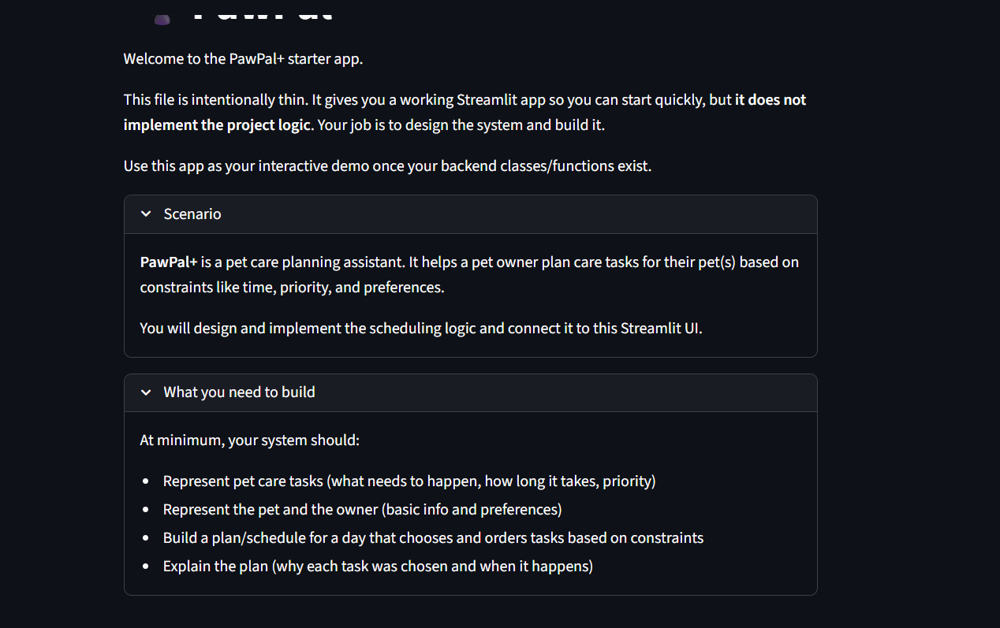

# PawPal+ (Module 2 Project)

## 📸 Demo

<a href="demopic.png" target="_blank"></a>

You are building **PawPal+**, a Streamlit app that helps a pet owner plan care tasks for their pet.

## Scenario

A busy pet owner needs help staying consistent with pet care. They want an assistant that can:

- Track pet care tasks (walks, feeding, meds, enrichment, grooming, etc.)
- Consider constraints (time available, priority, owner preferences)
- Produce a daily plan and explain why it chose that plan

Your job is to design the system first (UML), then implement the logic in Python, then connect it to the Streamlit UI.

## What you will build

Your final app should:

- Let a user enter basic owner + pet info
- Let a user add/edit tasks (duration + priority at minimum)
- Generate a daily schedule/plan based on constraints and priorities
- Display the plan clearly (and ideally explain the reasoning)
- Include tests for the most important scheduling behaviors

## Features

- Multi-pet task management: tracks multiple pets per owner, each with independent task lists.
- Sorting by time with deterministic tie-breakers: orders tasks by earliest start time, then priority, shorter duration, and task name for stable output.
- Filtering pipeline: filters tasks by pet name and completion status before planning or display.
- Conflict detection (time-window overlap): checks pairwise overlap using interval logic and returns readable conflict warnings instead of stopping execution.
- Daily and weekly recurrence: supports recurring tasks and due-day checks for one-off, daily, and weekly schedules.
- Recurrence rollover after completion: marking a recurring task complete automatically spawns the next task instance with the correct next occurrence day.
- Budget-aware greedy planning: builds a daily plan that respects total time budget and skips tasks that exceed budget or conflict with already scheduled tasks.
- Unscheduled reason reporting: records why tasks were skipped (for example, over budget or conflicting with another task).
- Human-readable plan explanation: produces plain-language schedule summaries with time window, priority, and duration.
- Professional Streamlit schedule view: displays sorted and filtered task tables, schedule success messages, and conflict warnings using Streamlit components.

## Getting started

### Setup

```bash
python -m venv .venv
source .venv/bin/activate  # Windows: .venv\Scripts\activate
pip install -r requirements.txt
```

### Suggested workflow

1. Read the scenario carefully and identify requirements and edge cases.
2. Draft a UML diagram (classes, attributes, methods, relationships).
3. Convert UML into Python class stubs (no logic yet).
4. Implement scheduling logic in small increments.
5. Add tests to verify key behaviors.
6. Connect your logic to the Streamlit UI in `app.py`.
7. Refine UML so it matches what you actually built.

## Smarter Scheduling

Recent scheduling upgrades include:

- Time-first sorting with deterministic tie-breakers (priority, duration, name)
- Task filtering by pet and completion status
- Recurring-task support for daily and weekly tasks
- Auto-generation of the next recurring task instance when a recurring task is completed
- Lightweight conflict detection that reports warnings instead of crashing
- Budget-aware planning that returns both scheduled tasks and unscheduled tasks with reasons

## Testing PawPal+

Run the automated tests with:

```bash
python -m pytest
```

Current tests cover core scheduler reliability, including:

- Task completion behavior
- Task addition to a pet
- Daily recurrence rollover (completing a daily task creates the next day task)
- Weekly recurrence rollover
- Chronological sorting correctness
- Conflict detection for duplicate/overlapping time windows

Confidence Level: 4/5 stars

Why 4/5: all current tests are passing, but the suite is still small and can be expanded with additional edge cases (for example, no-task pets, boundary time windows, and budget-limit scenarios).
